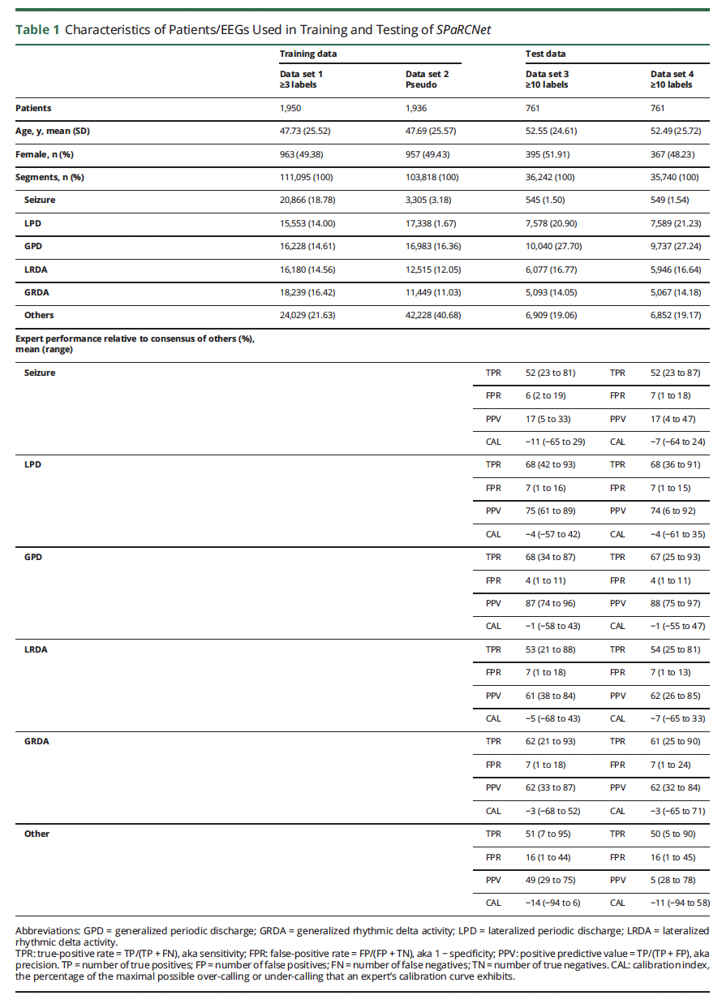

# IIIC-SPaRCNet
This repository provides code to reproduce figures in "Development of Expert-Level Classification of Seizures and Rhythmic and Periodic Patterns During EEG Interpretation". 

## References and papers
Jing J, Ge W, Hong S, Fernandes MB, Lin Z, Yang C, An S, Struck AF, Herlopian A, Karakis I, Halford JJ, Ng MC, Johnson EL, Appavu BL, Sarkis RA, Osman G, Kaplan PW, Dhakar MB, Arcot Jayagopal L, Sheikh Z, Taraschenko O, Schmitt S, Haider HA, Kim JA, Swisher CB, Gaspard N, Cervenka MC, Rodriguez Ruiz AA, Lee JW, Tabaeizadeh M, Gilmore EJ, Nordstrom K, Yoo JY, Holmes MG, Herman ST, Williams JA, Pathmanathan J, Nascimento FA, Fan Z, Nasiri S, Shafi MM, Cash SS, Hoch DB, Cole AJ, Rosenthal ES, Zafar SF, Sun J, Westover MB. **Development of Expert-Level Classification of Seizures and Rhythmic and Periodic Patterns During EEG Interpretation.** *Neurology*. 2023 Apr 25;100(17):e1750-e1762. doi: 10.1212/WNL.0000000000207127. Epub 2023 Mar 6. PMID: 36878708.

The [paper](IIIC_SPaRCNet.pdf)
The [supplemental material](IIIC_Classification-Supplemental.pdf)
[Commentary](IIIC_IRR_Commentary.pdf)

## Figures and Tables from Main Text

### Table 1: Characteristics of patients/EEGs used in training and testing of SzNet.

### Figure 1: Evaluation of model performance relative to experts: ROC curves

Solid curves are median ROC curves that show model performance; shading indicates 95% confidence bands. Expert operating points (x, y) on the ROC curve are shown as solid circles with (x, y) = (false-positive rate [FPR, aka 1 − specificity], true-positive rate [TPR, aka sensitivity]). Markers are colored in black when they lie above the median ROC curve of the model (better than model performance) and in gray when they lie below (inferior to model performance). EUROC = % of experts under the ROC curve; GPD = generalized periodic discharge; GRDA = generalized rhythmic delta activity; LPD = lateralized periodic discharge; LRDA = lateralized rhythmic delta activity; PPV = positive predicted value; ROC = receiver operating characteristic.

### Figure 2: Evaluation of model performance relative to experts: PR curves

Solid curves aremedian PR curves that show model performance; shading indicates 95% confidence bands. Expert operating points (x, y) on the PR curve are shown as solid triangles with (x, y) = (TPR, precision [aka positive predictive value (PPV)]). Markers are colored in black when they lie above themedian PR curve of the model (better thanmodel performance) and in gray when they lie below (inferior tomodel performance). EUPRC =% of experts under the PR curve; GPD = generalized periodic discharge; GRDA = generalized rhythmic delta activity; LPD = lateralized periodic discharge; LRDA = lateralized rhythmic delta activity; PR = precision recall.

### Figure 3 Maps of the Ictal-Interictal-Injury Continuum Learned by SPaRCNet

Two-dimensional coordinates are calculated by an algorithm (UMAP) such that patterns assigned similar probabilities for each class by the model are near each other in the map. The map learned by SparCNet (model) forms a “starfish” pattern, with the 5 IIIC patterns (SZ, LPD, GPD, LRDA, and GRDA) emanating as arms from a central region containing non-IIIC patterns. The coloring of the map indicates the model’s classification decisions and closely matches the pattern obtained by overlaying expert-consensus labels (human). Model uncertainty (uncertainty), indicating the degree to which the model assigns similar probabilities to multiple patterns, is greatest near the central region and decreases toward the tips of the “starfish” arms. The probability that an EEG segment represents a seizure or any one of the 4 most highly epileptiform patterns (the sum of the probabilities of SZ, LPD, GPD, or LRDA is shown in SZ burden and IIIC burden). GPD = generalized periodic discharge; GRDA = generalized rhythmic delta activity; IIIC = ictal-interictal-injury continuum; LPD = lateralized periodic discharge; LRDA = lateralized rhythmic delta activity; SZ = seizure.

### Figure 4: Examples of Smooth Pattern Transition for SZ (A) and LPD (B)

Samples are selected at different levels of model uncertainty ranging from the “starfish” arm tips toward the central area. IIIC patterns transition smoothly between distinct prototype patterns at the starfish arm tips into less distinct patterns near the body, lending credence to the concept of a “continuum” between ictal and interictal EEG patterns. IIIC = ictal-interictal-injury continuum; LPD = lateralized periodic discharge; SZ = seizure.

### Figure 5: Examples of Smooth Pattern Transition for GPD (A) and LRDA (B)

Samples are selected at different levels of model uncertainty ranging from the “starfish” arm tips toward the central area. GPD = generalized periodic discharge; LRDA = lateralized rhythmic delta activity. 

### Figure 6 Examples of Smooth Pattern Transition for GRDA (A) and “Other” (B) Samples

Samples are selected at different levels of model uncertainty ranging from the “starfish” arm tips toward the central area. GRDA = generalized rhythmic delta activity.

## Figures and Tables from Supplemental Material

### Figure S1. Web-based GUI used to collect annotations of EEG segments from multiple experts. 

There is no code for this figure. 

### Figure S2. Flow diagram for creation of training and test datasets. 

### Figure S3: Samples belonging to the same stationary period (SP) are assigned the same label. 
 

### Figure S4. Architecture of SzNet, based on the Dense-Net CNN architecture.

There is no code for this figure. 

### Figure S5. Creation of pseudo-labels via “label spreading” in Steps 3-4 of the model development procedure for SzNet.

A: The embedding map (“UMAP”) produced by the CNN trained in Step 1. “Real” labels from the 20 different experts are indicated by the colors; however, not all experts labeled all the points. To augment the training data, an individual UMAP was created for each expert and used to “spread” labels from the points that each expert did label (left hand UMAP in each of the pairs shown in B) to the points that the expert did not label (right-hand UMAP of each pair). These UMAPs were then averaged to create the single overall UMAP illustrated on the right in A. Note that the averaging process produces “soft” labels, whereas for illustration purposes the final UMAP depicted above is colored based on the IIIC pattern whose label has the highest value after label spreading. 

### Figure S6. Model development for SPaRCNet.

There is no code for this figure. 

### Figure S7. Thresholds used for “First or second-best classification”.  

There is no code for this figure. 

### Figure S8. Additional performance metrics for SzNet. 

(A) Bar plots showing average inter-rater reliability (IRR) between pairs of experts (ee-pIRR; light red bars) and the average agreement between the algorithm and each expert (ea-pIRR; dark red bars); and average agreement of experts with the label assigned by the majority of other experts (ee-mIRR) and of the algorithm with the majority of experts (ea-mIRR). The differences for each of these pairs is shown in B, with values above 0 indicating better performance for the algorithm (ea>ee), and values below 0 indicating better performance among experts. Confidence intervals are calculated via bootstrapping. The confusion matrices (CM) in subplots C, D, E, F expand on the IRR results, showing not only how well experts and algorithm agree with the label being treated for each analysis as the “correct answer” (numbers along the diagonals), but also showing the distribution of disagreements (values along each row).  

### Table S1. Prior literature in seizures and IIIC patterns detection.

There is no code for this Table. 

### Figure S9. PRISMA (Preferred Reporting Items for Systematic Reviews and Meta‐Analyses) flow diagram, where N corresponds to the number of articles.

There is no code for this figure. 
